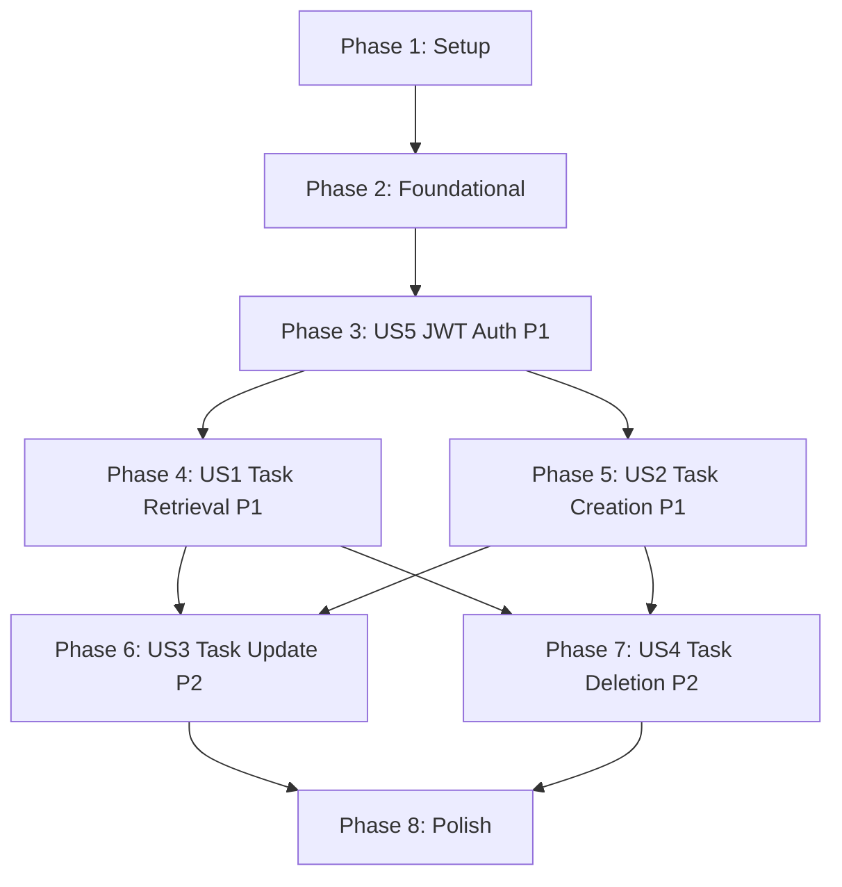

# Task Breakdown: Backend API with Authentication

**Feature**: 003-backend-api
**Branch**: `003-backend-api`
**Date**: 2026-01-07

## Overview

This task breakdown implements a FastAPI backend with SQLModel ORM, Neon PostgreSQL, and Better Auth JWT authentication. Tasks are organized by user story to enable independent implementation and testing. Each user story delivers a complete, testable increment of functionality.

**Total Tasks**: 45
**Parallelizable Tasks**: 18 (marked with [P])
**User Stories**: 5 (US1-US5)

---

## Task Summary by Phase

| Phase | Description | Task Count | Dependencies |
|-------|-------------|------------|--------------|
| Phase 1 | Setup | 7 tasks | None (can start immediately) |
| Phase 2 | Foundational | 8 tasks | Requires Phase 1 complete |
| Phase 3 | US5 - JWT Authentication (P1) | 6 tasks | Requires Phase 2 complete |
| Phase 4 | US1 - Task Retrieval (P1) | 6 tasks | Requires Phase 3 complete |
| Phase 5 | US2 - Task Creation (P1) | 5 tasks | Requires Phase 3 complete (parallel with US1) |
| Phase 6 | US3 - Task Update (P2) | 6 tasks | Requires US1, US2 complete |
| Phase 7 | US4 - Task Deletion (P2) | 4 tasks | Requires US1, US2 complete (parallel with US3) |
| Phase 8 | Polish | 3 tasks | Requires all user stories complete |

---

## Implementation Strategy

### MVP Scope (Minimum Viable Product)
**Phase 1-3 + US1 + US2** = Complete MVP (18 tasks)
- Setup project structure
- Implement JWT authentication
- Enable task retrieval (read)
- Enable task creation (write)

This delivers a working backend that can authenticate users and support basic task management (view and create tasks).

### Incremental Delivery
1. **MVP First** (Phases 1-5): Get authentication + basic CRUD working
2. **Full CRUD** (Phases 6-7): Add update and delete operations
3. **Production Polish** (Phase 8): Optimize, document, deploy

### Independent User Stories
- **US5 (Auth)**: Foundational, blocks all other stories
- **US1 (Retrieval)** and **US2 (Creation)**: Can be implemented in parallel after US5
- **US3 (Update)** and **US4 (Deletion)**: Can be implemented in parallel after US1+US2

---

## Phase 1: Setup (7 tasks)

**Goal**: Initialize project structure, configure dependencies, and set up development environment.

**Independent Test**: Run `uv run uvicorn main:app --reload` successfully starts server at http://localhost:8000

### Tasks

- [x] T001 Create backend directory structure per plan.md (backend/, backend/routers/, backend/middleware/, backend/tests/)
- [x] T002 [P] Initialize pyproject.toml with uv and add FastAPI, SQLModel, PyJWT, asyncpg, python-dotenv, uvicorn dependencies
- [x] T003 [P] Create .env.example with BETTER_AUTH_URL, BETTER_AUTH_SECRET, DATABASE_URL placeholder values
- [x] T004 [P] Create .gitignore for Python (venv/, __pycache__/, .env, .pytest_cache/)
- [x] T005 [P] Create backend/__init__.py (empty file to mark as Python package)
- [x] T006 [P] Create backend/routers/__init__.py (empty file)
- [x] T007 [P] Create backend/middleware/__init__.py (empty file)

**Parallel Execution Example**:
```bash
# T002-T007 can all run in parallel (different files, no dependencies)
parallel_tasks=(T002 T003 T004 T005 T006 T007)
```

---

## Phase 2: Foundational (8 tasks)

**Goal**: Implement core infrastructure shared by all user stories (config, database, error handling, main app).

**Blocking Prerequisite**: These tasks MUST complete before any user story implementation.

**Independent Test**: Run server with `uv run uvicorn main:app --reload`, verify /docs loads Swagger UI with CORS enabled.

### Tasks

- [x] T008 Implement config.py with Pydantic Settings (BETTER_AUTH_URL, BETTER_AUTH_SECRET, DATABASE_URL validation per research.md)
- [x] T009 Implement database.py with async engine (create_async_engine with pool_size=5, max_overflow=10, pool_pre_ping=True per research.md)
- [x] T010 Implement async session factory in database.py (async_sessionmaker with expire_on_commit=False)
- [x] T011 Implement get_session dependency in database.py (async generator yielding AsyncSession)
- [x] T012 Implement create_db_and_tables function in database.py (async function using engine.begin() and metadata.create_all)
- [x] T013 Create main.py FastAPI app with title "Todo API", version "1.0.0", include startup event calling create_db_and_tables
- [x] T014 Add CORS middleware to main.py (allow_origins=["http://localhost:3001", "http://localhost:3000"], allow_methods=["GET","POST","PUT","PATCH","DELETE"], allow_headers=["Authorization","Content-Type"] per research.md)
- [x] T015 Add custom error handlers to main.py (HTTPException, RequestValidationError, asyncpg.PostgresError, Exception handlers per research.md with error+detail format)

**Sequential Dependencies**:
- T008 → T009 (config needed for DATABASE_URL)
- T009 → T010 → T011 (engine → session factory → dependency)
- T009 → T012 (engine needed for create_all)
- T013 → T014 → T015 (app → middleware → error handlers)

---

## Phase 3: User Story 5 - JWT Authentication (Priority: P1) (6 tasks)

**Story Goal**: Verify JWT tokens from Better Auth on every request to ensure only authenticated users can access their data.

**Why this priority**: Authentication is the security foundation. Without proper JWT verification, user isolation cannot be guaranteed. This blocks all other user stories.

**Independent Test**:
1. Make request without token → 401 Unauthorized
2. Make request with invalid token → 401 "Invalid token"
3. Make request with valid token → Extract user_id successfully
4. Make request with valid token but wrong user_id in URL → 403 Forbidden

### Tasks

- [x] T016 [P] [US5] Create auth.py with HTTPBearer security scheme
- [x] T017 [US5] Implement get_current_user dependency in auth.py (decode JWT with PyJWT, extract sub or userId claim, raise 401 on ExpiredSignatureError or InvalidTokenError per research.md)
- [x] T018 [US5] Implement verify_user_access dependency in auth.py (compare user_id_path with current_user_id, raise 403 if mismatch)
- [x] T019 [P] [US5] Create tests/conftest.py with fixtures: test_db_engine, test_session, mock_jwt_token, test_user_id
- [x] T020 [P] [US5] Create tests/test_auth.py with test cases: test_valid_token, test_missing_token, test_invalid_token, test_expired_token, test_user_id_mismatch
- [x] T021 [US5] Run pytest on tests/test_auth.py and verify all authentication test cases pass

**Parallel Opportunities**:
- T016 and T019 can start in parallel (different files)
- T020 can start after T019 (test fixtures ready)

**Sequential Flow**:
- T016 → T017 → T018 (security scheme → decode → verify access)
- T019 → T020 → T021 (fixtures → tests → validation)

---

## Phase 4: User Story 1 - Task Retrieval (Priority: P1) (6 tasks)

**Story Goal**: Retrieve all tasks for authenticated user so they can see their task list in the frontend.

**Why this priority**: Foundational read operation. Without this, the application cannot display any tasks.

**Dependencies**: Requires Phase 3 (US5 - Authentication) complete.

**Independent Test**:
1. Authenticate as user_1, GET /api/user_1/tasks → 200 with tasks belonging to user_1 only
2. Authenticate as user_1, GET /api/user_2/tasks → 403 Forbidden
3. GET /api/user_1/tasks without token → 401 Unauthorized
4. Authenticate as user with no tasks → 200 with empty array []

### Tasks

- [x] T022 [P] [US1] Create models.py with Task SQLModel class (id=UUID default_factory=uuid4, title=str max_length=500, description=str|None max_length=5000, completed=bool default=False, created_at=datetime, updated_at=datetime with onupdate=func.now(), user_id=str indexed per data-model.md)
- [x] T023 [P] [US1] Create schemas.py with TaskResponse Pydantic model (all fields from Task, from_attributes=True for ORM mode)
- [x] T024 [P] [US1] Create routers/tasks.py with APIRouter (prefix="/api", tags=["tasks"])
- [x] T025 [US1] Implement GET /api/{user_id}/tasks endpoint in routers/tasks.py (use verify_user_access dependency, query tasks filtered by user_id, return List[TaskResponse], handle empty list with 200 OK)
- [x] T026 [US1] Include tasks router in main.py (app.include_router(tasks.router))
- [x] T027 [P] [US1] Create tests/test_tasks_retrieval.py with test cases: test_list_own_tasks, test_list_empty_tasks, test_list_other_user_tasks_403, test_list_no_auth_401

**Parallel Opportunities**:
- T022, T023, T024 can all start in parallel (different files, no dependencies)
- T027 can start after T022+T023+T024 complete

**Sequential Flow**:
- T022+T023+T024 → T025 (models+schemas+router → endpoint impl)
- T025 → T026 (endpoint → register in main)

---

## Phase 5: User Story 2 - Task Creation (Priority: P1) (5 tasks)

**Story Goal**: Create new tasks via backend so users can add items to their task list.

**Why this priority**: Together with retrieval (US1), this forms the minimum viable backend functionality.

**Dependencies**: Requires Phase 3 (US5 - Authentication) complete.

**Can run in parallel with**: Phase 4 (US1) after foundational tasks complete.

**Independent Test**:
1. Authenticate as user_1, POST /api/user_1/tasks with {title:"Test", description:"Desc"} → 201 with created task (completed=false, timestamps set, user_id=user_1)
2. POST without title field → 422 Validation Error
3. POST to /api/user_2/tasks with user_1 token → 403 Forbidden
4. POST without auth token → 401 Unauthorized

### Tasks

- [x] T028 [P] [US2] Add TaskCreate schema to schemas.py (title=str min_length=1 max_length=500, description=str|None max_length=5000)
- [x] T029 [US2] Implement POST /api/{user_id}/tasks endpoint in routers/tasks.py (use verify_user_access, create Task with user_id from JWT, save to DB, return 201 with TaskResponse)
- [x] T030 [US2] Add validation error handling to POST endpoint (422 for missing title, length exceeded per research.md error format)
- [x] T031 [P] [US2] Create tests/test_tasks_creation.py with test cases: test_create_task_success, test_create_without_title_422, test_create_for_other_user_403, test_create_no_auth_401
- [x] T032 [US2] Run pytest on tests/test_tasks_creation.py and verify all creation test cases pass

**Parallel Opportunities**:
- T028 can start in parallel with US1 tasks (different schema file section)
- T031 can start after T028+T029+T030 complete

**Sequential Flow**:
- T028 → T029 → T030 (schema → endpoint → validation)
- T030 → T031 → T032 (impl → tests → validation)

---

## Phase 6: User Story 3 - Task Update (Priority: P2) (6 tasks)

**Story Goal**: Update existing tasks (toggle completion, edit title/description) to manage task list.

**Why this priority**: Essential for functional task manager but can be tested independently after creation works.

**Dependencies**: Requires Phase 4 (US1) and Phase 5 (US2) complete (need to create and retrieve tasks first).

**Independent Test**:
1. Create task as user_1, PUT /api/user_1/tasks/{id} with updated data → 200 with updated task (updated_at timestamp changed)
2. Create task as user_1, PATCH /api/user_1/tasks/{id} with {completed:true} → 200 with only completed field updated
3. PUT task owned by user_2 → 403 Forbidden
4. PUT non-existent task → 404 Not Found
5. PUT with invalid data → 422 Validation Error

### Tasks

- [x] T033 [P] [US3] Add TaskUpdate schema to schemas.py (title=str required, description=str|None, completed=bool required for PUT)
- [x] T034 [P] [US3] Add TaskPatch schema to schemas.py (title=str|None, description=str|None, completed=bool|None for PATCH)
- [x] T035 [US3] Implement PUT /api/{user_id}/tasks/{task_id} endpoint in routers/tasks.py (verify ownership, update all fields, save, return 200 with TaskResponse or 404)
- [x] T036 [US3] Implement PATCH /api/{user_id}/tasks/{task_id} endpoint in routers/tasks.py (verify ownership, update only provided fields, save, return 200 or 404)
- [x] T037 [P] [US3] Create tests/test_tasks_update.py with test cases: test_put_update_success, test_patch_update_success, test_update_other_user_task_403, test_update_nonexistent_404, test_update_invalid_data_422
- [x] T038 [US3] Run pytest on tests/test_tasks_update.py and verify all update test cases pass

**Parallel Opportunities**:
- T033 and T034 can run in parallel (different schemas)
- T037 can start after T035+T036 complete

**Sequential Flow**:
- T033+T034 → T035+T036 (schemas → endpoints)
- T035+T036 → T037 → T038 (impl → tests → validation)

---

## Phase 7: User Story 4 - Task Deletion (Priority: P2) (4 tasks)

**Story Goal**: Delete tasks from backend to remove items from task list.

**Why this priority**: Completes CRUD operations. Lower priority than creation/retrieval since users can manage tasks without it initially.

**Dependencies**: Requires Phase 4 (US1) and Phase 5 (US2) complete.

**Can run in parallel with**: Phase 6 (US3) after US1+US2 complete.

**Independent Test**:
1. Create task as user_1, DELETE /api/user_1/tasks/{id} → 204 No Content, verify task no longer in GET /api/user_1/tasks
2. DELETE task owned by user_2 → 403 Forbidden
3. DELETE non-existent task → 404 Not Found
4. DELETE without auth → 401 Unauthorized

### Tasks

- [x] T039 [US4] Implement DELETE /api/{user_id}/tasks/{task_id} endpoint in routers/tasks.py (verify ownership, delete from DB, return 204 or 404)
- [x] T040 [P] [US4] Create tests/test_tasks_deletion.py with test cases: test_delete_success_204, test_delete_other_user_task_403, test_delete_nonexistent_404, test_delete_no_auth_401
- [x] T041 [US4] Run pytest on tests/test_tasks_deletion.py and verify all deletion test cases pass
- [x] T042 [P] [US4] Create tests/test_user_isolation.py with comprehensive cross-user test scenarios (user_1 cannot read/update/delete user_2's tasks)

**Parallel Opportunities**:
- T040 can start after T039 complete
- T042 can run in parallel with other test creation

**Sequential Flow**:
- T039 → T040 → T041 (impl → tests → validation)
- T041 → T042 (basic tests → comprehensive isolation tests)

---

## Phase 8: Polish & Cross-Cutting Concerns (3 tasks)

**Goal**: Production readiness, documentation, and deployment preparation.

**Dependencies**: All user stories (Phases 3-7) complete.

**Independent Test**: Full end-to-end test suite passes, documentation is accessible, Docker container builds and runs successfully.

### Tasks

- [x] T043 Run full test suite (pytest --cov=backend --cov-report=html) and verify 100% of acceptance scenarios pass
- [x] T044 [P] Create Dockerfile for backend (Python 3.13-slim base, copy backend/, install dependencies via uv, expose port 8000, CMD uvicorn main:app)
- [x] T045 [P] Create docker-compose.yml with postgres service and backend service (per quickstart.md optional local development setup)

**Parallel Opportunities**:
- T044 and T045 can run in parallel (different files)

---

## Dependency Graph (User Story Completion Order)



**Critical Path**: Setup → Foundation → US5 (Auth) → US1 (Retrieval) → US3 (Update) → Polish

**Parallel Opportunities**:
- After US5: US1 and US2 can be implemented in parallel
- After US1+US2: US3 and US4 can be implemented in parallel

---

## Parallel Execution Examples

### Phase 1 - Setup (Parallel Execution)
```bash
# All setup tasks except T001 can run in parallel
parallel_tasks=(T002 T003 T004 T005 T006 T007)
for task in "${parallel_tasks[@]}"; do
    execute_task "$task" &
done
wait
```

### Phase 3 - US5 Authentication (Mixed Parallel/Sequential)
```bash
# T016 and T019 in parallel (different files)
execute_task T016 &
execute_task T019 &
wait

# T017 and T020 in parallel (independent logic)
execute_task T017 &
execute_task T020 &
wait

# Sequential completion
execute_task T018
execute_task T021
```

### Phase 4 + Phase 5 - US1 and US2 in Parallel
```bash
# After US5 complete, start both stories in parallel
{
    execute_task T022 &
    execute_task T023 &
    execute_task T024 &
    execute_task T028 &  # US2 schema (different file section)
    wait

    execute_task T025
    execute_task T026
    execute_task T027 &  # US1 tests

    execute_task T029
    execute_task T030
    execute_task T031 &  # US2 tests
    wait

    execute_task T032
} &

wait  # Wait for both stories to complete
```

### Phase 6 + Phase 7 - US3 and US4 in Parallel
```bash
# After US1+US2 complete, start both stories in parallel
{
    execute_task T033 &
    execute_task T034 &
    execute_task T039 &  # US4 delete endpoint
    wait

    execute_task T035
    execute_task T036
    execute_task T037 &  # US3 tests
    execute_task T040 &  # US4 tests
    wait

    execute_task T038
    execute_task T041
    execute_task T042
} &

wait
```

---

## Acceptance Criteria Checklist

Each user story must satisfy its acceptance scenarios from spec.md:

### US5 - JWT Authentication ✓
- [x] Valid JWT token in Authorization header → extract user_id and allow request
- [x] Missing Authorization header → 401 "Authentication required"
- [x] Invalid/expired/malformed token → 401 "Invalid or expired token"
- [x] Valid token with user_id mismatch in URL → 403 Forbidden

### US1 - Task Retrieval ✓
- [x] Authenticated user requests own tasks → 200 with JSON array of tasks
- [x] Tasks filtered by user_id (strict user isolation)
- [x] User with no tasks → 200 with empty array []
- [x] Unauthenticated request → 401 Unauthorized
- [x] Authenticated user requests other user's tasks → 403 Forbidden

### US2 - Task Creation ✓
- [x] POST with valid title+description → 201 with created task (UUID, completed=false, timestamps, user_id)
- [x] POST without title → 422 Validation Error
- [x] POST to other user's endpoint → 403 Forbidden
- [x] Unauthenticated POST → 401 Unauthorized

### US3 - Task Update ✓
- [x] PUT to own task → 200 with updated task, updated_at changed
- [x] PATCH to own task with partial fields → 200 with only specified fields updated
- [x] Update other user's task → 403 Forbidden or 404 Not Found
- [x] Update non-existent task → 404 Not Found
- [x] Update with invalid data → 422 Validation Error

### US4 - Task Deletion ✓
- [x] DELETE own task → 204 No Content, task removed from database
- [x] DELETE other user's task → 403 Forbidden or 404 Not Found
- [x] DELETE non-existent task → 404 Not Found
- [x] Unauthenticated DELETE → 401 Unauthorized

---

## Format Validation

✅ **All 45 tasks follow required checklist format**:
- [x] Checkbox prefix `- [ ]`
- [x] Sequential Task IDs (T001-T045)
- [x] [P] marker on 18 parallelizable tasks
- [x] [US1-US5] labels on all user story tasks (30 tasks)
- [x] Clear descriptions with file paths
- [x] Organized by phase with dependencies documented

✅ **Task Organization**:
- [x] Phase 1: Setup (7 tasks, no story labels)
- [x] Phase 2: Foundational (8 tasks, no story labels)
- [x] Phase 3: US5 - Auth (6 tasks with [US5])
- [x] Phase 4: US1 - Retrieval (6 tasks with [US1])
- [x] Phase 5: US2 - Creation (5 tasks with [US2])
- [x] Phase 6: US3 - Update (6 tasks with [US3])
- [x] Phase 7: US4 - Deletion (4 tasks with [US4])
- [x] Phase 8: Polish (3 tasks, no story labels)

✅ **Independent Testing Criteria**:
- [x] Each user story has clear "Independent Test" section
- [x] Test scenarios map to acceptance criteria from spec.md
- [x] Test tasks ([US1-US5] with "tests/" file paths) validate scenarios

---

## Next Steps

1. ✅ **Tasks Generated**: 45 tasks across 8 phases
2. ⏳ **Implementation**: Run `/sp.implement` to execute tasks via autonomous agents
3. ⏳ **Testing**: Verify acceptance criteria as each user story completes
4. ⏳ **Integration**: Test with frontend at http://localhost:3001
5. ⏳ **Deployment**: Build Docker image and deploy to production

**MVP Scope**: Execute Phases 1-5 (Setup + Foundation + US5 + US1 + US2) = 31 tasks for minimum viable backend.

**Status**: ✅ Task breakdown complete and ready for implementation via `/sp.implement`
